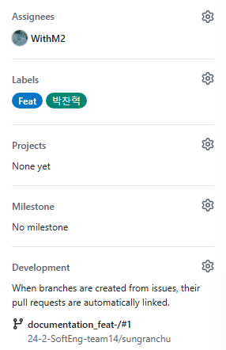

# sungranchu

성랜추 레포입니다.

## Front Guideline

### Title

[Feat] : 새로운 파일을 새로 구현할 때

[Fix] : 기존 파일을 수정할 때

[Network] : Back과 api 연결할 때

ex) [Feat] Login page

### Assignees

해당 작업을 진행하는 인원 추가

### Labels

해당 작업의 성격, 작업 진행중인 인원 기록
Feat, Fix, Network, documentation, bug report, etc..
현재 누가 어떤 작업을 진행중인지 확인을 위함.

### Branch

이슈를 생성하면 오른쪽에 Create a branch 버튼을 눌러서 브랜치 생성.
브랜치 이름 : 작업명\_성격/#브랜치 번호
ex) Login_page_feat/#1
이슈로 생성한 브랜치는 자동으로 번호가 부여됩니다.
이렇게 생성된 브랜치에서 작업한 뒤 push, PR 날리고 승인이 되면 자동으로 브랜치가 삭제됩니다.
(이슈 생겼을 시 브랜치별로 확인하기 위함)

### Check

전부 올바르게 설정했다면, 아래 사진처럼 표시됩니다.

### PR

기본적으로 바쁘지 않다면 본인의 PR은
다른 팀원이 승인해주는 방식으로 하는게 좋을 것 같습니다.
예외적으로, 이번만 Guideline은 제가 직접 PR 승인 하겠습니다.
